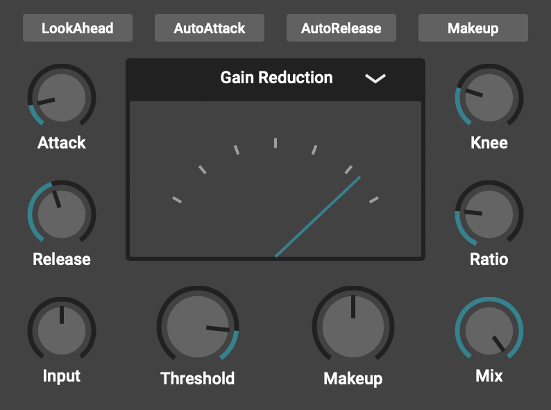

## Homework 2 - Group 3 - La Lobby
# CTAGDRC (CTAG Dynamic Range Compressor)

The selected JUCE plugin is "CTAGDRC" (i.e. CTAG Dynamic Range Compressor), by p-hlp (https://github.com/p-hlp/CTAGDRC). The attached report focuses on an overview of the general characteristics of the compressor and then switches to the analysis of a particular feature, namely its "Look-ahead" mode, which implements an interesting way of handling possible complications that may occur while using the plugin.

# About
The **CTAG Dynamic Range Compressor** is a VST3 plugin, built to be an easy-to-use, good-sounding tool, well suited for any kind of application.
The control circuit is fed with a copy of the input signal and calculates the needed attenuations which are then multiplied with the input signal. 
One might recognize this diagram since it pretty much resembles an analog VCA-Compressor. In a VCA-Compressor the voltage controlled amplifier attenuates a signal according to an external control voltage coming from the control circuit.

This is the **GUI** of the plugin:

From the graphical interface we can see these parameters that can be set.  

The main parts the plugin is divided into are:

+ **Main Controls**:
#### General
- **Input:** The Input knob adjusts the level of the signal before any processing happens. Driving the input signal harder into the compressor can be used as an alternative to lowering the threshold.
- **Makeup:** The Makeup knob adjusts the level of the output signal after the compression was applied. Generally speaking, compression lowers the output level of a signal by design. This lets you compensate for any loss or gain in volume.
- **Mix:** The Mix knob enables you to mix between the dry and processed signal. This can be used for parallel processing and enables use-cases like NY-Style drum compression. 
- **LookAhead:** The LookAhead button enables the LookAhead-Mode. If the compressor is used as a limiter (Ratio infinity:1 & instant attack time) it will anticipate the incoming peaks and fade in the aggressive gain reductions, thus preventing distortion from happening.
  
#### Gain Computer
- **Threshold:** The Threshold knob adjusts the level above which the compressor starts attenuating the input signal. The Input knob alternatively can be used to drive the signal harder into the compressor, resulting in a less low threshold being needed. Be careful to not drive the signal too hard or it'll start clipping.
- **Ratio:** The Ratio knob determines how much the signal is attenuated above the chosen threshold. For a ratio of 4:1, one dB remains for every 4dB of input signal above the threshold. At a ratio of 1:1 no compression is happening, as the input is exactly the output. At a ratio of inifinity:1 (knob all the way to the right) the compressor is acting as a limiter, meaning that everything above the treshold is completely compressed away.
- **Knee:** The Knee knob is used to achieve a rounder compression curve. Having a *hard knee* (knob all the way to the left) means that the compressor will only start working if the input signal is above the threshold and will stop working immediately when it is below. Using a *soft knee* on the other hand will define a range *(knee/2)* above and under the threshold, where the compressor will slowly start or stop compressing, resulting in a more gradual and transparent compression.

#### Ballistics
- **Attack:** The Attack knob sets the time that determines how fast the compression will set in once the signal exceeds the threshold. Generally speaking you want a rather fast attack time for transient-rich signals like drums to minimize overshoot. 
- **Release:** The Release knob sets the time that determines how fast the compressor will recover from the gain reduction once the signal falls under the threshold. Depending on the input signal, short release times may introduce a "pumping" effect and/or distortion.
  
#### Parameter Automation
- **Auto Makeup:** The AutoMakeup button enables automatic makeup gain. Based on the average attentuations applied to the input signal. This features tries to keep the input signal and the processed output signal as close as possible in perceived loudness. This is a time-varying effect and may introduce unwanted volume changes to the output signal.
- **Auto Attack & Auto Release:** The AutoAttack and AutoRelease buttons enable/disable the automation of the time constants. Based on the ratio of peak and rms level of the input signal the compressor can make assumptions about the "transient-richness" of the signal and automate the ballistics accordingly.

#### Metering
- **Gainreduction:** This is a simple gainreduction meter. Right-most indicator is 0dB gainreduction and therefore no compression. The left-most indicator is -30dB, middle indicator -15dB. 
- **Input/Output:** The Input/Output meter is a "VU-Style" peak meter. Right-most indicator 0dBFS. Left-most indicator -50dBFS.

### Group members
Nicolò Chillè, Rocco Scarano, Enrico Dalla Mora, Federico Caroppo
