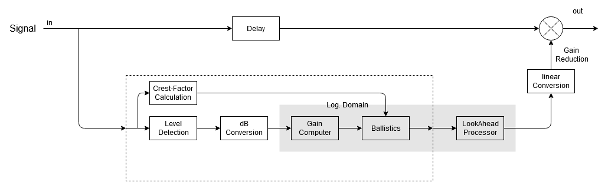

## Homework 2 - Group 3 - La Lobby
# CTAGDRC (CTAG Dynamic Range Compressor)

The selected JUCE plugin is "CTAGDRC" (i.e. CTAG Dynamic Range Compressor), by p-hlp (https://github.com/p-hlp/CTAGDRC). The attached report focuses on an overview of the general characteristics of the compressor and then switches to the analysis of a particular feature, namely its "Look-ahead" mode, which implements an interesting way of handling possible complications that may occur while using the plugin.

# About
The **CTAG Dynamic Range Compressor** is a VST3 plugin, built to be an easy-to-use, good-sounding tool, well suited for any kind of application.
The topology chosen by the author of the plugin is the feedforward topology, resembling the one of an analog VCA-Compressor.

From the graphical interface we can see the parameters that can be set:
- Attack and Release
- Knee
- Ratio
- Input gain
- Threshold
- Makeup
- Mix
- LookAhead
- AutoAttack
- AutoRelease

# Report organization
After a brief discussion on the topology of the plugin we analyzed it's architecture:

Given the previous diagram the report focuses on the following features by analyzing their implementation:
- Level Detection
- Domain Conversion
- Gain Computing (ballistics)
- Automation
- Crest Factor
- LookAhead Mode

### Group members
Nicolò Chillè, Rocco Scarano, Enrico Dalla Mora, Federico Caroppo
